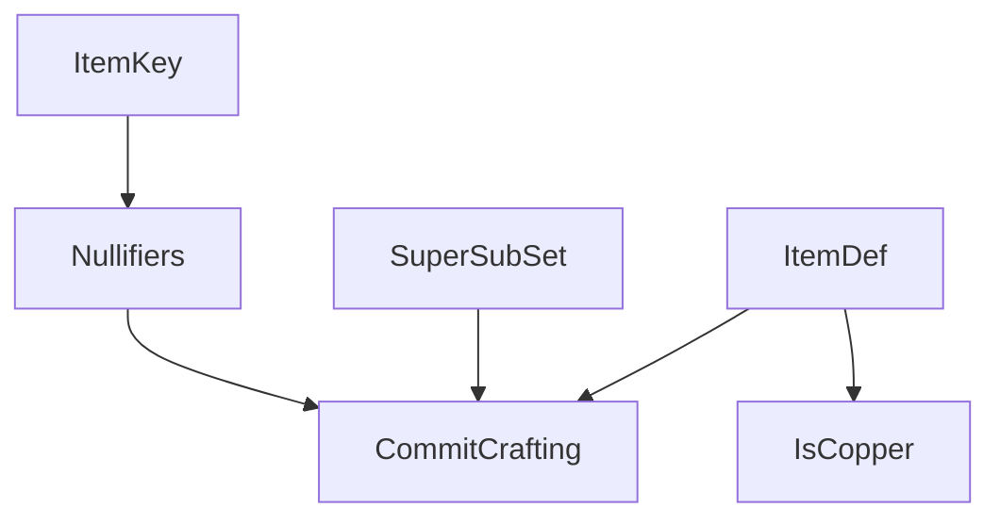

# Commit predicates
```
// Generic recursive construction confirming subset.  Relies on the Merkle
// tree already requiring unique keys (so no inserts on super)
SuperSubSet(super, sub) = OR(
    Equal(sub, {})
    SuperSubSetRecursive(super, sub)
)

SuperSubSetRecursive(super, sub, private: i, smaller) = AND(
    SetContains(super, i)
    SetInsert(sub, smaller, i)
    SuperSubSet(super, smaller)
)

// Prove proper derivation of item ID from defined inputs
// The ingredients dict is explicitly allowed to contain more fields
// for use in item predicates.
ItemDef(item, ingredients, inputs, key, work) = AND(
    DictContains(ingredients, "inputs", inputs)
    DictContains(ingredients, "key", key)
    HashOf(item, ingredients, work)
)

// Helper to expose just the item and key from ItemId calculation.
// This is just the CraftedItem pattern with some of inupts private.
ItemKey(item, key, private: ingredients, inputs, work) = AND(
    ItemDef(item, ingredients, inputs, key, work)
)

// Derive nullifiers from items (using a recursive foreach construction)
// This proves the relationship between an item and its key before using
// the key to calculate a nullifier.
Nullifiers(nullifiers, inputs) = OR(
    NullifiersEmpty(nullifiers, inputs)
    NullifiersRecursive(nullifiers, inputs)
)

NullifiersEmpty(nullifiers, inputs) = AND(
    Equal(nullifiers, {})
    Equal(inputs, {})
)

NullifiersRecursive(nullifiers, inputs, private: i, n, k, ns, is) = AND(
    ItemKey(i, k)
    HashOf(n, k, "consumed item external nullifier")
    SetInsert(nullifiers, ns, n)
    SetInsert(inputs, is, i)
    Nullifiers(ns, is)
)

// ZK version of CraftedItem for committing on-chain.
// Validator/Logger/Archiver needs to maintain 2 append-only
// sets of items and nullifiers.  New crafting is
// accepted iff:
// - item is not already in item set
// - all nullifiers are not already in nullifier set
// - createdItems is one of the historical item set roots
CommitCrafting(item, nullifiers, created_items, private: ingredients, inputs, key, work) = AND(
    // Prove the item hash includes all of its committed properties
    ItemDef(item, ingredients, inputs, key, work)

    // Prove all inputs are in the created set
    SuperSubSet(created_items, inputs)

    // Expose nullifiers for all inputs
    Nullifiers(nullifiers, inputs)
)
```

# App predicates: crafting game
```
// Example of a mined item with no inputs or sequential work.
// Copper requ`ires working in a copper mine (blueprint="copper") and
// 10 leading 0s.
IsCopper(item, private: ingredients, inputs, key, work) = AND(
    ItemDef(item, ingredients, inputs, key, work)
    Equal(inputs, {})
    Equal(work, 0)
    DictContains(ingredients, "blueprint", "copper")

    // TODO input POD: HashInRange(0, 1<<10, ingredients)
)
```

# Dependency graph


